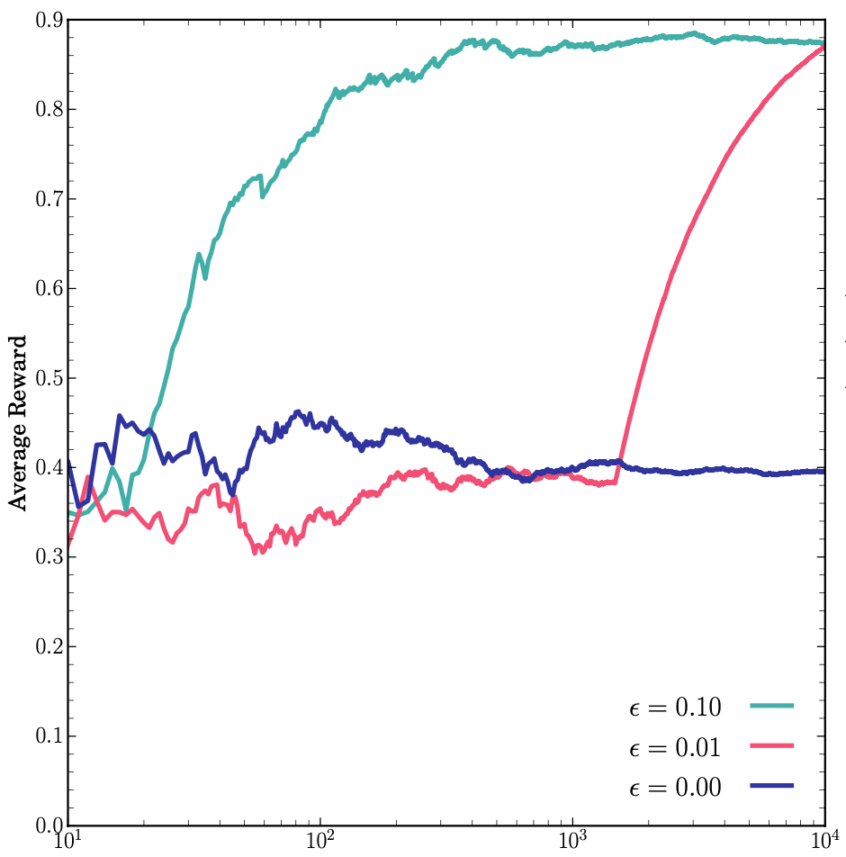

# Reinforcement Learning

A repository to learn and practice ideas in reinforcement learning, starting with classical problems such as the multi-armed bandit and moving towards more complex control tasks and risk evaluation. The main reference is [this book](https://web.stanford.edu/class/psych209/Readings/SuttonBartoIPRLBook2ndEd.pdf) by Sutton and Barto.

## Contents

* *Multi-Armed Bandit:* An implementation of the multi-armed bandit problem to illustrate the trade-off between the greedy and exploratory strategies. A summary of the theory and the code can be found [here](https://james-alvey-42.github.io/multiarmedbandit).

